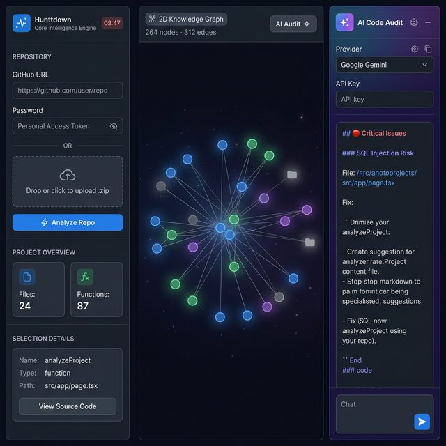

<div align="center">

# ⚡ Hunttdown

### Core Intelligence Engine for Your Codebase

**Visualize · Analyze · Audit** — Turn any GitHub repository or ZIP archive into an interactive knowledge graph with AI-powered security auditing in seconds.

[](https://nextjs.org)
[](https://typescriptlang.org)
[](https://supabase.com)
[](https://huggingface.co)
[](LICENSE)

---



</div>

---

## 🚀 What is Hunttdown?

Hunttdown is a **real-time codebase intelligence tool** that parses any TypeScript/JavaScript repository and renders it as a live **force-directed knowledge graph**. Every file, function, class, and their relationships become explorable nodes. An AI audit sidebar lets you run security and quality analysis on the entire codebase using your own API key (Google Gemini or any OpenAI-compatible provider).

> **Think:** GitHub Copilot meets a 3D code map, but for security audits.

---

## ✨ Features

<table>
<tr>
<td width="50%">

### 🗺️ Interactive Knowledge Graph
- Force-directed 2D graph with **color-coded node types**
  - 🔵 Files · 🟢 Functions · 🟣 Classes · ⬜ Folders
- Click any node to inspect its **dependencies & callers**
- Real-time **Cmd+K semantic search** across your codebase
- Zoom, pan, drag — fully interactive canvas

</td>
<td width="50%">

### 🤖 AI Security Audit Sidebar
- Persistent collapsible right panel — always available
- Supports **Google Gemini** and custom OpenAI-compatible providers
- Scans for **OWASP vulnerabilities**, memory leaks, race conditions, dead code, and performance bottlenecks
- Multi-turn **follow-up chat** with full conversation context
- Auto-highlights vulnerable files on the graph

</td>
</tr>
<tr>
<td width="50%">

### 🔍 Semantic Code Search
- Embeddings generated via **`nomic-ai/modernbert-embed-base`** (HuggingFace)
- pgvector-powered similarity search in Supabase
- Falls back to full-text search if vector index is not set up
- Searches across function signatures, doc comments, and content

</td>
<td width="50%">

### ⚡ Performance-First Design
- Binary/media files (`.png`, `.svg`, `.mp4`, `.woff`, `.map`, etc.) are **never loaded** into the graph
- Minified files (`.min.js`) excluded automatically
- Parallel batch embedding updates (50× faster than serial)
- 10-minute ephemeral sessions — project data auto-wiped from DB

</td>
</tr>
</table>

---

## 📸 Screenshots

<details>
<summary><b>📊 Knowledge Graph View</b></summary>
<br/>

The graph renders your entire codebase as interconnected nodes. Files import other files (edges), functions are called by other functions (call-graph edges), and classes contain methods. Clicking a node shows its live dependency analysis pulled from Supabase.

</details>

<details>
<summary><b>🤖 AI Audit Panel</b></summary>
<br/>

The right sidebar uses your own API key to perform a structured security and quality audit. Results are streamed in real time in a chat interface with markdown rendering — critical issues in red, high in orange, medium in yellow, low in green.

</details>

<details>
<summary><b>🔍 Cmd+K Search</b></summary>
<br/>

Press `Cmd+K` (or `Ctrl+K`) anywhere on the graph to open the semantic search overlay. Type a function name, concept, or pattern and jump straight to the matching node.

</details>

---

## 🛠️ Tech Stack

| Layer | Technology |
|---|---|
| **Framework** | Next.js 15 (App Router, Server-Sent Events) |
| **Language** | TypeScript 5 |
| **AST Parser** | `ts-morph` — full TypeScript/JavaScript AST traversal |
| **Database** | Supabase (PostgreSQL + pgvector) |
| **Embeddings** | HuggingFace `nomic-ai/modernbert-embed-base` via `@huggingface/inference` |
| **Graph Rendering** | Custom force-simulation canvas renderer |
| **AI Providers** | Google Gemini, OpenAI-compatible (custom endpoint) |
| **Styling** | Vanilla CSS + Tailwind utilities |
| **Icons** | Lucide React |

---

## ⚙️ Getting Started

### Prerequisites

- Node.js 20+
- A [Supabase](https://supabase.com) project
- A [Hugging Face](https://huggingface.co/settings/tokens) API token (free)
- A [Google AI Studio](https://aistudio.google.com/app/apikey) key (for AI audit)

### 1. Clone & Install

```bash
git clone https://github.com/sh3xu/hunttdown.git
cd hunttdown
npm install
```

### 2. Configure Environment

Create a `.env.local` file:

```env
# Supabase
NEXT_PUBLIC_SUPABASE_URL=https://your-project.supabase.co
NEXT_PUBLIC_SUPABASE_ANON_KEY=your_anon_key
SUPABASE_SERVICE_ROLE_KEY=your_service_role_key

# Hugging Face (for code embeddings)
HF_TOKEN=hf_your_token_here
```

### 3. Set Up Supabase Schema

Run the following SQL in your Supabase SQL editor:

```sql
-- Enable pgvector extension
create extension if not exists vector;

-- Projects table
create table projects (
  id uuid primary key default gen_random_uuid(),
  name text not null,
  url text,
  root_path text,
  expires_at timestamptz,
  created_at timestamptz default now()
);

-- Nodes table
create table nodes (
  id uuid primary key default gen_random_uuid(),
  project_id uuid references projects(id) on delete cascade,
  node_id text not null,
  name text,
  type text,
  path text,
  line int,
  content text,
  signature text,
  doc_comment text,
  embedding vector(768)  -- 768 dims for nomic modernbert-embed-base
);

-- Edges table
create table edges (
  id uuid primary key default gen_random_uuid(),
  project_id uuid references projects(id) on delete cascade,
  from_node text,
  to_node text,
  relation text,
  call_count int default 1
);

-- Vector similarity search function
create or replace function match_nodes(
  query_embedding vector(768),
  project_id_filter uuid,
  match_count int default 10
)
returns table (id uuid, node_id text, name text, type text, path text, similarity float)
language sql stable
as $$
  select id, node_id, name, type, path,
    1 - (embedding <=> query_embedding) as similarity
  from nodes
  where project_id = project_id_filter
    and embedding is not null
  order by embedding <=> query_embedding
  limit match_count;
$$;

-- Optional: IVFFlat index for faster vector search on large codebases
create index on nodes using ivfflat (embedding vector_cosine_ops) with (lists = 100);
```

### 4. Run Development Server

```bash
npm run dev
```

Open [http://localhost:3000](http://localhost:3000) — you're ready to go! 🎉

---

## 🔐 How It Works

```
GitHub URL or ZIP
        │
        ▼
  ┌──────────────┐
  │  Clone / Extract │
  └──────────────┘
        │
        ▼
  ┌──────────────────────────────────────┐
  │          ts-morph AST Engine          │
  │  Pass 1: Build node registry          │
  │   → files, folders, functions, classes│
  │  Pass 2: Trace call graph edges       │
  │   → imports, calls, contains          │
  └──────────────────────────────────────┘
        │
        ▼
  ┌──────────────────────┐
  │  Supabase Insert      │
  │  nodes + edges        │
  └──────────────────────┘
        │
        ▼
  ┌──────────────────────────────┐
  │  HuggingFace Embeddings       │
  │  nomic-ai/modernbert-embed-base│
  │  → 768-dim vectors per symbol │
  │  → stored in pgvector         │
  └──────────────────────────────┘
        │
        ▼
  ┌──────────────────────┐
  │  Force-directed Graph │
  │  streamed to browser  │
  └──────────────────────┘
```

---

## 🔒 Privacy & Security

- **Your code never leaves your control** — it's cloned server-side into a temp directory and wiped after the session.
- **AI API keys are never stored** — they are only used for the duration of the request and sent directly to the provider.
- All project data is automatically **expired after 10 minutes** by a TTL on the `expires_at` column — or wipe it instantly yourself via the "Obliterate Project" button.

---

## 🗺️ Roadmap

- [ ] GitHub OAuth for private repo access without PAT
- [ ] Python / Go / Rust parser support
- [ ] Export graph as JSON / SVG
- [ ] Shareable session links
- [ ] VS Code extension

---

## 🤝 Contributing

Pull requests are welcome! For major changes, please open an issue first.

1. Fork the repo
2. Create your feature branch: `git checkout -b feat/amazing-feature`
3. Commit your changes: `git commit -m 'feat: add amazing feature'`
4. Push to the branch: `git push origin feat/amazing-feature`
5. Open a Pull Request

---

## 📄 License

MIT © [shexu](https://github.com/sh3xu)

---

<div align="center">
  <sub>Built with ❤️ using Next.js, ts-morph, Supabase, and HuggingFace</sub>
</div>
